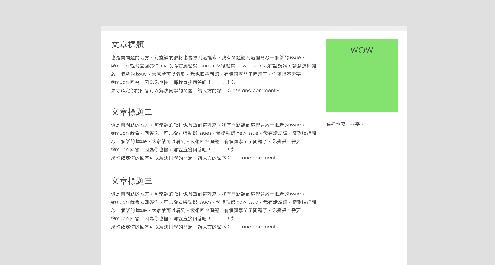
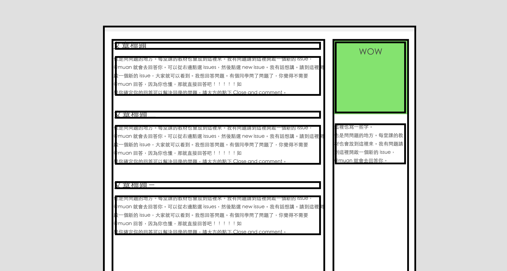

第二堂課練習
==========

把 `homework.html` 加上 css 變成 `demo.jpg`.

提示：這次要練習使用～

1. `display: inline-block`
2. `vertical-align: top`
3. CSS box model

---

### 繳交作業方式

1. 點選 <kbd>Clone in Desktop</kbd> 按鈕，把整個資料夾存到你電腦裡頭
2. 開啟一個**平行世界**！
3. 打開 `homework.html` 開始寫作業。
4. 一邊 Commit!
5. 不用一下子就把全部寫完，有幾個 commits 之後就可以 <kbd>Publish Branch</kbd>。
6. 可以先開啟一個 Pull Request，開啟之後一邊有問題可以在 Pull Request 上面用留言方式問我問題。

:v:
